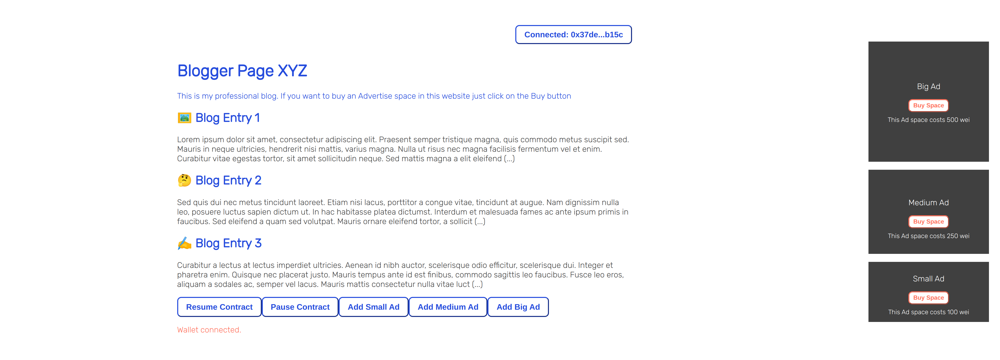
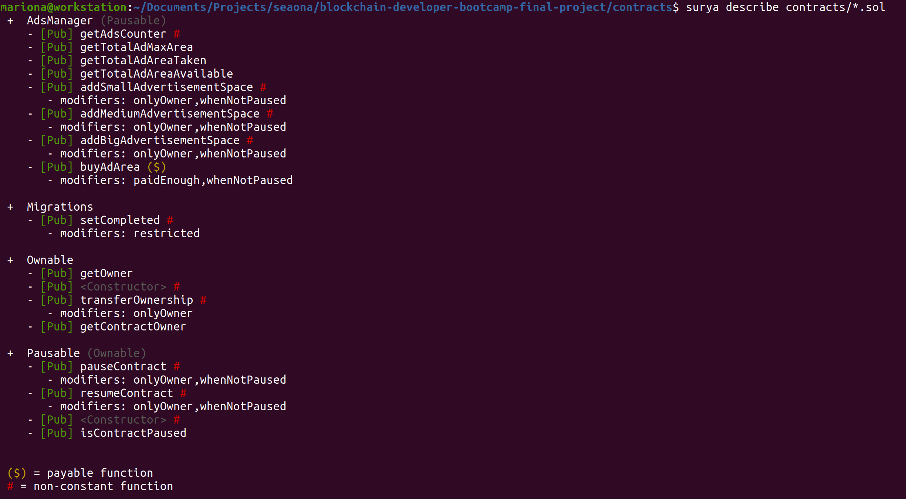
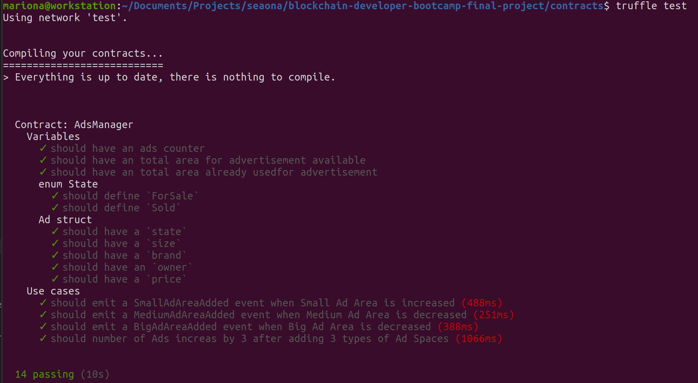
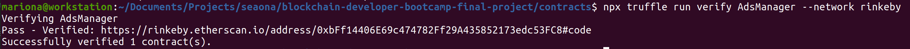
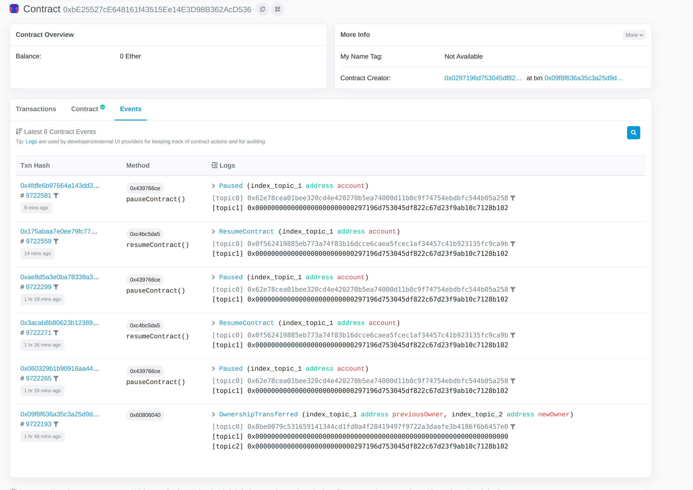
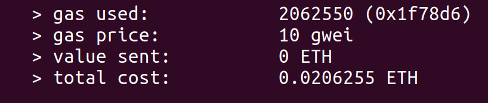

# Manage Ads for your Website

## Overview
[Deployment Process walk through](https://www.youtube.com/watch?v=hd_inZSWP00)

[Frontend Process walk through](https://www.youtube.com/watch?v=S5XU99J4ayk)

[Live Website](https://website-ads-management.herokuapp.com/)



## Summary
This project aims to become a tool for selling space on your website for advertisement purposes. Brands can buy Advertisement Space from your website.

**Goal**: the goal is to define a rotatory model for owning website space by advertisers.

1. The website owner can generate Advertisement spaces in his/her website and put them for Sale
2. Brands can buy Ad spaces and place their Advertisement in the Space that they have pruchased.
3. Advertisement Spaces come in 3 different versions:
    - Small: this is a small advertisement area, it costs 100 units of token
    - Medium: this is a medium advertisement area, it costs 250 units of token
    - Big: this is a big advertisement area, it costs 500 units of token
4. An Ad will be represented as an struct with the followign parameters:
    ```
    struct Ad {
        State state;
        Size size;
        bytes32 brand;
        address payable owner;
        uint256 price;
    }```
5. State can be ForSale or Sold, and each Advertisement will have an owner. If the Ad is not already sol, the owner of the ad is the owner of the website.
6. The website owner can take down existing ads.
7. The website owner can also Pause or Resume the contract


**Note**: Further tokenomics must be defined, like how often the ownership can be changed (i.e. days / months) until a new auction is open again

## Live Working Version
- A life working version can be found at the Github page.
- Deployed address and network can be found at the [txt file](deployed_address.txt).

## Project Patterns
[Design Patterns](design_pattern_decisions.md) and [Security Practices](avoiding_common_attacks.md) used in this project, for avoiding common attacks can be found on the corresponding files.
## High Level Overview
In the following console print you can see a high level overview of the project functionalities.



This export has been done using Surya capabilities, a [tool](https://github.com/ConsenSys/surya) developed by Consensys.
You can install it by following their repo instructions and run the command:

``surya ftrace APMRegistry::_newRepo all MyContract.sol``


## Local Build
### Pre Requisites
1. Download or clone the repo
2. Setup environment: create .env file (copy .env.safe) and include your Infura, mnemonic and EtherScan API

### Smart Contracts
This is the example of the run of the following commands:


1. Go to `contacts` folder:

```cd contracts```

2. Compile contracts:

```truffle compile```

3. Start truffle development environment:
```truffle dev```

4. Migrate contracts on the desired network:

```
(truffle) migrate --reset --network develop
(truffle) migrate --reset --network rinkeby
(truffle) migrate --reset --network mainnet
(truffle) migrate --reset --network bsctestnet
(truffle) migrate --reset --network bsc
```
5. Run Smart Contract Unit Tests:

```truffle compile```



### Verify Source Code on EtherScan
It is possible to verify and publish the code of your contract(s), so anyone can audit it on the blockchain. If you implement this, people will be able to see all the code and interact with the contract on the Read/Write tabs.


For implementing this, after deploying to the network (testnet or mainnet) you can follow these steps:

- Install the dev dependency truffle-plugin-verify (already installed if you used the last package.json file)
- Include ETHERSCAN_API_KEY= for interacting with EtherScan
- Check plugin is added to the truffle-config file
- Run the following command on the terminal: 

```npx truffle run verify ContractName --network rinkeby```

After some minutes, you should see this on your console:


### Contract Events
This project is designed with the user interface in mind. For that, most of the functions of the smart contract trigger events. The events can be found on the Events tag of Etherscan.


### GasPrice Calculation
For each network, if unspecified, transaction options will default to the following values:
- gas: Gas limit used for deploys. Default is 6721975.
- gasPrice: Gas price used for deploys. Default is 20000000000 (20 Gwei).

For checking the rela time gasPrice, go to [Eth Gas Station](https://ethgasstation.info/) and for converting Gwei to Wei check the [Eth Unit Converter](https://coinguides.org/ethereum-unit-converter-gwei-ether/).

Deploying this contracted costed on Rinkeby:



### Frontend
1. Go to `frontend` folder:

```cd frontend```

2. Install the required dependencies

```npm i```

3. Run the frontend client:

## Dependencies Used and Credits
**Smart Contracts**:
- Truffle as development environment for compiling, depoying and testing the smart contracts
- Networks configured: Rinkeby, Develop, Binancechain, Binancetestnet and Develop
- Etherscan API is used for contract verification

**Frontend**: 
- React
- Starter Setup based on [Alchemy's NFT Minter tutorial](https://docs.alchemyapi.io/alchemy/tutorials/nft-minter) for frontend design
- Metamask provider


## Public Ethereum Address for Certification
Ethereum Account for Certification: 0x0297196d753045df822C67d23F9aB10c7128b102

## Next Steps
- [ ] Choose Ad position by Priority (enum Position {Best, Medium, Worse}) depending on the visibility of the position
- [ ] Add more units tests to include test coverage
- [ ] Build this as a pluggable extension for any website
- [ ] Event indexing for a better UI/UX experience