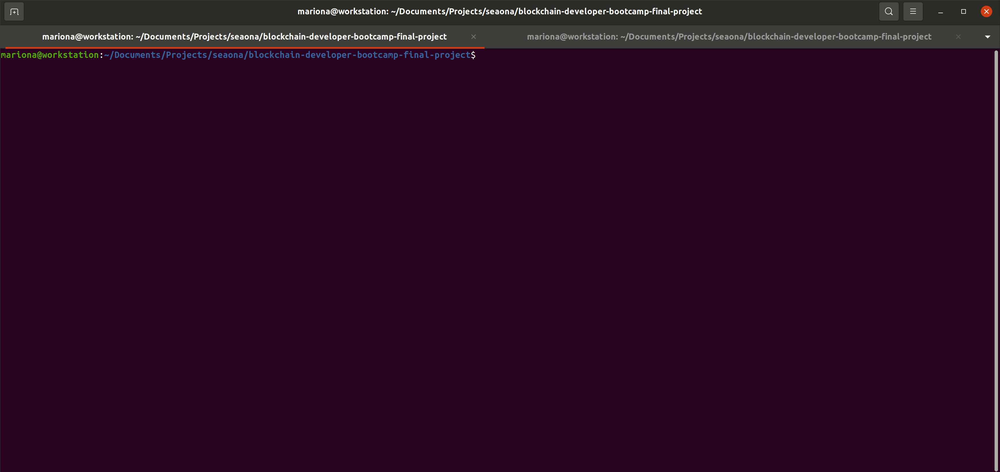

# NFT Ads for your Website
## Summary
This project aims to become a tool for selling space on your website for introducing ads via the use of the ERC-721 standard.

**Goal**: the goal is to define a rotatory model for owning website space by advertisers.

1. The website owner generates an open position for onwing some space into their webstie, so an advertisor can add their ad.
2. This "space" (one or many) is minted as a new NFT and an auction is open permanently for owning that asset.
3. The owner of the NFT can then upload their ad and display it into the website space reserved for that ad, making the final payment to the owner of the website.

**Note**: Further tokenomics must be defined, like how often the ownership can be changed (i.e. days / months) until a new auction is open again


## Local Build
### Smart Contract
1. Go to `minter-contacts` folder:

```cd minter-contracts```

2. Start a local node:

```npx hardhat node```

3. Deploy the smart contracts in the localhost network:

```npx hardhat run --network localhost scripts/deploy.js```




### Frontend
1. Go to `minter-dapp` folder:

```cd minter-contracts```

2. Install the required dependencies

```npm i```

3. Run the frontend client:

## Dependencies and Credits
Frontend: 
- React
- Starter Setup based on [Alchemy's NFT Minter tutorial](https://docs.alchemyapi.io/alchemy/tutorials/nft-minter)
- Metamask provider

Smart Contracts:
- Hardhat as development environment for compiling, depoying and testing the smart contracts
- Networks configured: Ropsten and Localhost
- Etherscan API for contract verification


