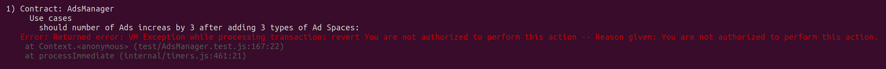

# Design Patterns Desicions
Design patterns used in this project:
- **Access Control Design Patterns**: this project has in place access controls for specific functions. These are applied in the form of Contract Owner and Advertisement Area Owner and restricted some functions depending on the address, with the help of modifiers.
    - Example: function call from unathorized account makes test fail

- **Upgradable/Lifecycle Contracts**: this project takes into account software development lifecycle. For this reason, the contract can be paused and (in the future) upgreadble by the contract owner. Ownership of the contract can be transferred too.
    - Contract has a State (operational or not): ``bool public operational = true;``
    - Contract State can be modified: ``function setOperatingStatus(bool mode) public onlyOwner``

- **Optimizing Gas**: this project takes into account gas costs of deployment and cost of interaction with the contract. Following the [SolidityGasSample guide](https://github.com/thedarkjester/SolidityGasSamples), I've implemented some of the best practices, such as:
    - using mapping instead of arrays. I.e. ``mapping (uint => Ad) ads;``
    - using Structs instead of multiple varibles. I.e. ``Struct Ad``
    - using constant instead of immutable as it's cheaper. I.e. ``uint256 constant totalAdMaxArea = 200;``
    - using bytes over string when possible. I.e. ``bytes32 brand``
    - incrementing value by using variable++ as it's cheaper. I.e. ``adsCounter++;``
    - preferring the use of modifiers instead of requires, as are cheaper. I.e. ``onlyOwner, paidEnough``
- **Inheritance and Interfaces**: this project uses inheritance since to main contract ``AdsManager`` inherits from ``Pausable`` contract. Furthermore, it uses an external library, ``SafeMath.sol``, from OpenZeppelin to avoid overflow and underflow effects on addition and substraction operations.
    - Inheritance: ``contract AdsManager is Pausable``
    - Use of SafeMath library: ``using SafeMath for uint256;``